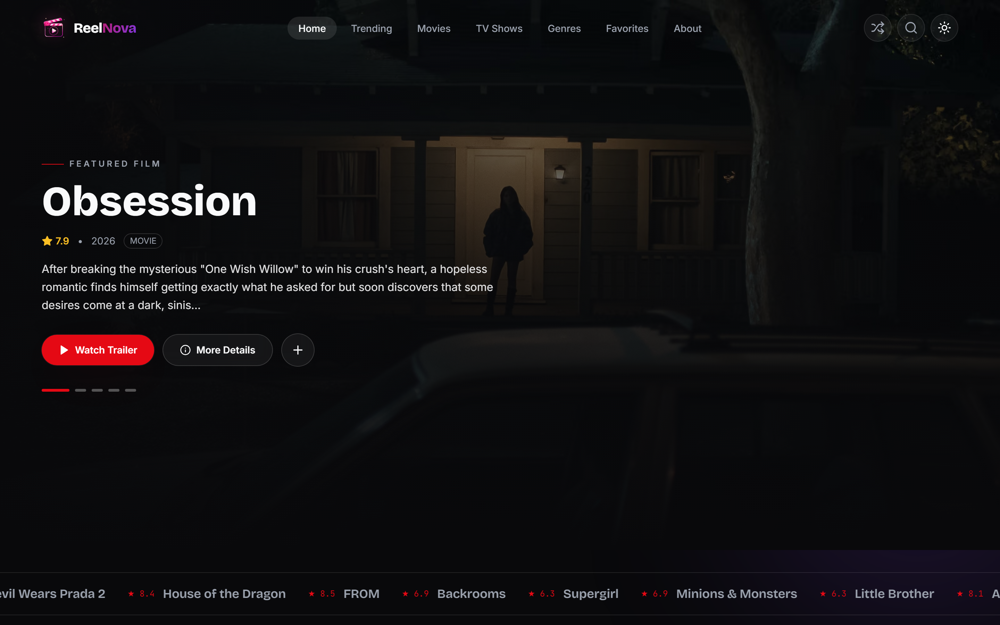
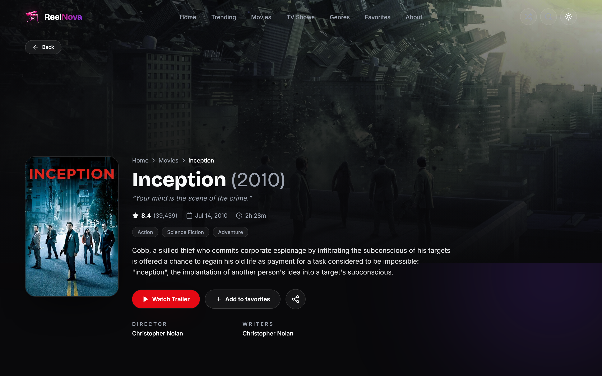
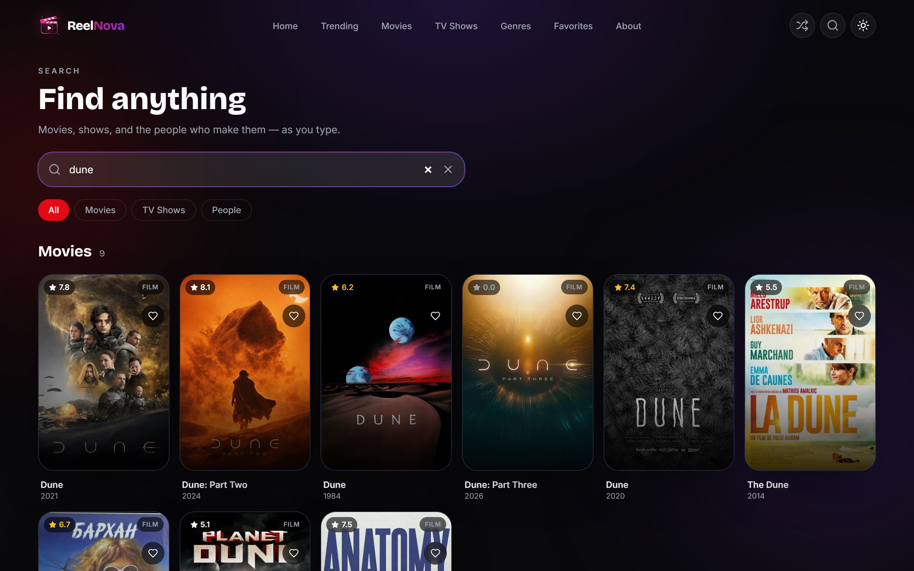
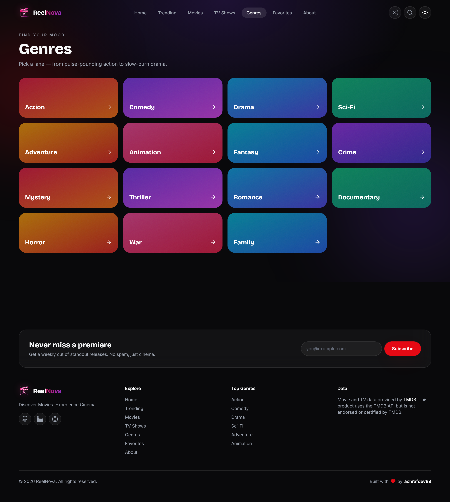

<div align="center">

# 🎬 ReelNova

### Discover Movies. Experience Cinema.

A premium, cinematic movie & TV discovery app built with **Next.js 14**, **Tailwind CSS**, and the **TMDB API**.


**[🌐 Live Demo](https://reelnova-coral.vercel.app)**



</div>

---

## ✨ Overview

ReelNova is a design-forward, fully responsive frontend for browsing movies and TV shows. It pulls live data from [The Movie Database (TMDB)](https://www.themoviedb.org) and wraps it in a cinematic interface — animated content rails, a rich detail view with trailers and cast, genre browsing, infinite scroll, a command-palette search, and a local favorites collection. No backend required.

### 🎥 Demo


### 📸 Screenshots

| Home | Movie detail |
| --- | --- |
|  |  |

| Search | Genres |
| --- | --- |
|  |  |

> Screenshots and the demo GIF are generated automatically — see [Generating media](#-generating-media).

---

## 🚀 Features

- **Cinematic home page** — film-grain hero, trending marquee ticker, and 8+ curated rails
- **Movies & TV libraries** — infinite scroll with filters (genre, year, rating, sort)
- **Detail pages** — backdrop hero, trailer modal, top cast, where-to-watch, gallery, reviews, and recommendations
- **Top-10 ranked rails** — numbered rank stamps for trending content
- **Instant search** — debounced multi-search (movies, TV, people) plus a ⌘K / Ctrl+K command palette
- **Genre browsing** — gradient genre grid with per-genre sort and media-type toggle
- **Favorites** — save titles locally; persists on-device, no account needed
- **Polished UX** — glassmorphism, gradient accents, smooth Framer Motion transitions, dark cinematic theme
- **Performance** — React Query caching, optimized `next/image`, lazy loading
- **Accessible** — semantic markup, focus-visible rings, reduced-motion support
- **Custom 404** and route-level loading states

---

## 🛠️ Tech Stack

| Area | Tools |
| --- | --- |
| Framework | Next.js 14 (App Router), React 18 |
| Language | JavaScript |
| Styling | Tailwind CSS, custom design system |
| Animation | Framer Motion |
| Data | TMDB API, Axios, TanStack React Query v5 |
| Forms | React Hook Form + Zod |
| UI | Lucide Icons, Swiper, React Hot Toast, next-themes |

---

## 📦 Getting Started

### Prerequisites

- **Node.js 18.17+**
- A free **TMDB API key** — [create one here](https://www.themoviedb.org/settings/api)

### Installation

```bash
# 1. Clone the repo
git clone https://github.com/achrafdev89/reelnova.git
cd reelnova

# 2. Install dependencies
npm install

# 3. Add your TMDB key
cp .env.example .env.local
```

Then open `.env.local` and add your key:

```env
NEXT_PUBLIC_TMDB_API_KEY=your_tmdb_v3_api_key_here
NEXT_PUBLIC_TMDB_BASE_URL=https://api.themoviedb.org/3
```

> Use a **TMDB v3 API key** (the short key from API settings), not the v4 read access token.

### Run

```bash
npm run dev      # start dev server at http://localhost:3000
npm run build    # production build
npm run start    # serve the production build
npm run lint     # lint
```

---

## 📁 Project Structure

```
reelnova/
├── app/                  # App Router pages
│   ├── page.js           # Home
│   ├── movies/           # Movie library
│   ├── tv/               # TV library + detail
│   ├── movie/[id]/       # Movie detail
│   ├── trending/         # Trending
│   ├── genres/           # Genre grid + [id] detail
│   ├── search/           # Search
│   ├── favorites/        # Saved titles
│   ├── about/            # About
│   ├── layout.js         # Root layout + providers
│   ├── providers.js      # React Query, theme, favorites, toaster
│   ├── not-found.js      # Custom 404
│   └── loading.js        # Route loading state
├── components/           # UI components (cards, rails, modals, nav…)
├── context/              # Favorites context
├── hooks/                # React Query + utility hooks
├── services/             # TMDB service layer
├── lib/                  # Axios client + helpers
├── constants/            # Site config, genres, image helpers
└── tailwind.config.js    # Design tokens
```

---

## 🔌 API

All data comes from TMDB via a thin service layer (`services/tmdb-service.js`) over a shared Axios client (`lib/tmdb.js`). If no key is configured, the app shows a friendly setup notice instead of failing.

---

## 📷 Generating media

Screenshots and the demo GIF are produced by [Playwright](https://playwright.dev) against the live site (or a local build), then assembled with `ffmpeg`.

```bash
# one-time setup
npm install
npx playwright install chromium    # download the browser
# ffmpeg also required for the GIF (preinstalled on most CI / macOS via brew)

# capture everything (screenshots → docs/screenshots, gif → docs/demo.gif)
npm run media

# or run them separately
npm run shots                       # screenshots only
npm run demo                        # demo GIF only

# target a local dev server instead of the deployed site
BASE_URL=http://localhost:3000 npm run media
```

`BASE_URL` defaults to the deployed site, so `npm run media` works out of the box. The capture routes and the demo walkthrough live in `scripts/capture.mjs` and `scripts/demo.mjs`.

**On autopilot:** the [`Generate media`](.github/workflows/media.yml) GitHub Action regenerates and commits these assets — trigger it manually from the **Actions** tab (optionally passing a different URL) or let the weekly schedule keep them fresh.

---


Deploys cleanly to **Vercel**:

1. Push to GitHub
2. Import the repo in Vercel
3. Add the env vars (`NEXT_PUBLIC_TMDB_API_KEY`, `NEXT_PUBLIC_TMDB_BASE_URL`)
4. Deploy

Any host that supports Next.js 14 works as well.

---

## 🗺️ Roadmap

- [ ] Person/cast detail pages with filmography
- [ ] Watch-provider region selector
- [ ] Light theme polish
- [ ] Optional Supabase sync for favorites across devices

---

## 📄 License

[MIT](LICENSE) — free to use and adapt.

---

## 🙏 Credits

- Data & images: [The Movie Database (TMDB)](https://www.themoviedb.org). _This product uses the TMDB API but is not endorsed or certified by TMDB._
- Icons: [Lucide](https://lucide.dev)

---

<div align="center">

Built with ❤️ by [**achrafdev89**](https://github.com/achrafdev89)

</div>
